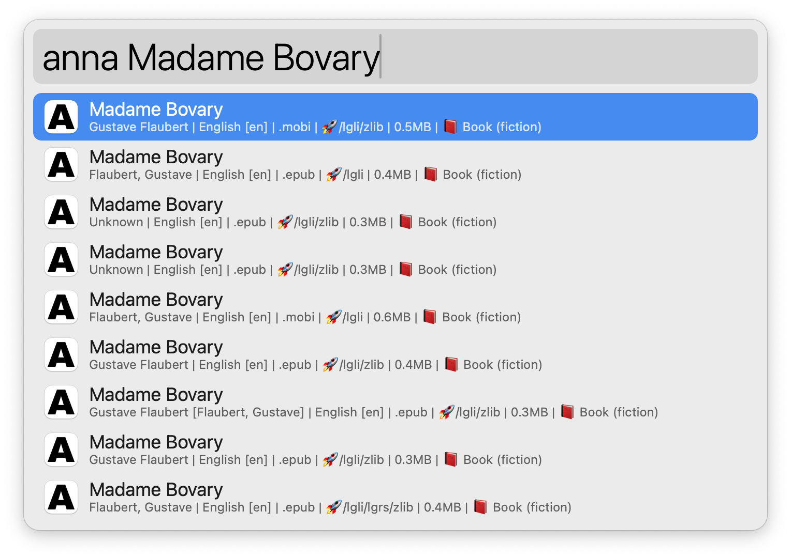
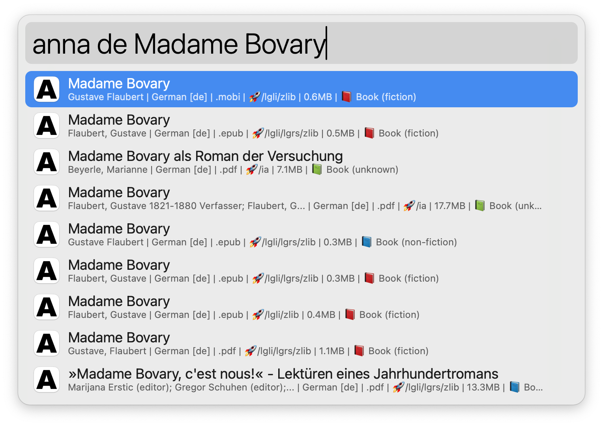
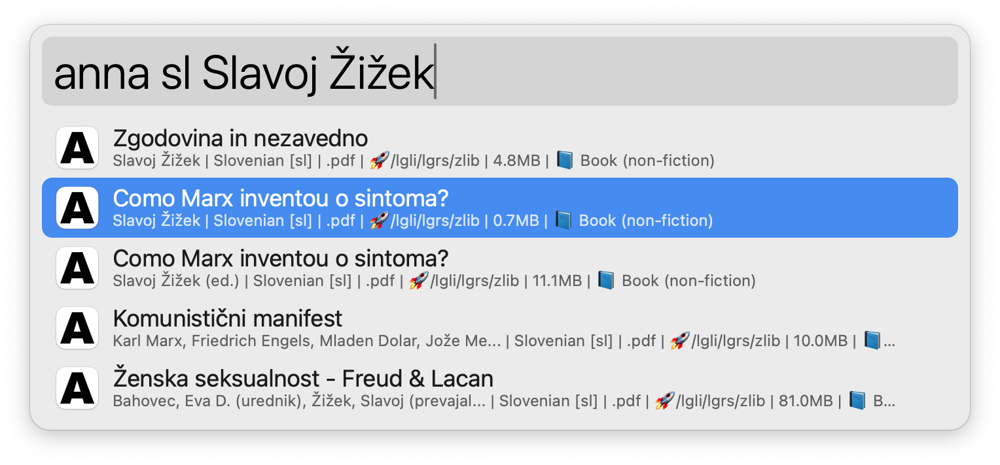

# Anna's Archive Workflow for Alfred

## 👋 Introduction

- This [Alfred](https://www.alfredapp.com/) workflow allows you to search for and download books from [Anna's Archive](https://annas-archive.org/). Anna's Archive is a search engine for [shadow libraries](https://en.wikipedia.org/wiki/Shadow_library).

## 🌟 Features

- **Search Books**: Quickly search for books using keywords.
- **Customizable Results**: Display search results with customizable subtitles.
- **Language Filtering**: Filter search results by specified languages by setting the language filter variable or live when searching.
- **Direct Download**: Download books directly from the search results. It currently supports downloading books with the `/lgli` (Libgen) source.

## 🚀 Installation

1. Download the Workflow: Obtain the Alfred workflow file from the repository ([⤓ here](https://github.com/svenko99/alfred-annas-archive/releases/latest/download/Anna.s.Archive.alfredworkflow)).
2. Install the Workflow: Double-click the downloaded workflow file to install it in Alfred.
3. Set Up Environment Variables: Optionally, configure the environment variables in Alfred for customized behavior.

## 🔧 Workflow variables

<strong>Optional custom subtitle</strong>: Customize the subtitle format for search results. Default format is <code>{0} | {1} | {2} | {3} | {4} | {5}</code> where each placeholder corresponds to a specific book attribute.

 
<ul>
    <li> {0}: Authors</li>
    <li> {1}: Book language</li>
    <li> {2}: File type</li>
    <li> {3}: Source</li>
    <li> {4}: Size</li>
    <li> {5}: Content</li>
     
    <li> Lets take for example <a href=https://annas-archive.org/md5/522a43ee06ef4e3c23b86610e8d96268">this book</a> with the following attributes:</li>
    <ul>
        <li>Authors: Gustave Flaubert</li>
        <li>Book language: English [en]</li>
        <li>File type: .mobi</li>
        <li>Source: 🚀/lgli/zlib</li>
        <li>Size: 0.5MB</li>
        <li>Content: 📕 Book (fiction)</li>
    </ul>
     
    <li> The default subtitle format would display as follows:</li>
    <ul>
        <li><code>Gustave Flaubert | English [en] | .mobi | 🚀/lgli/zlib | 0.5MB | 📕 Book (fiction)</code></li>
    </ul>
     
    <li> But lets say we only want to display the book language and the size separated by a comma, we would set the custom subtitle to <code>{1}, {4}</code> and the subtitle would display as follows:</li>
    <ul>
        <li><code>English [en], 0.5MB</code></li>
    </ul>
</ul>

<strong>Optional language filter</strong>: Specify the languages to filter search results. Default is all languages.

 
<ul>
    <li>
        The language filter is a comma-separated list of language codes (<a href="https://en.wikipedia.org/wiki/ISO_639-1">ISO 639-1</a>). For example, to filter search results to English and Russian books, set the language filter to <code>en,ru</code>.
    </li>
</ul>

## 💡 Usage examples

#### Basic Search

- Type the keyword for the workflow followed by your search query, e.g., `anna Madame Bovary`.

#### Live Language-Specific Search

- Type the keyword for the workflow followed by a language code and your search query, e.g., `anna en Madame Bovary` or `anna de Madame Bovary`.
  - ⚠️ **Clarification**: There are two options for language filters. When you specify languages in the workflow variable, you don't need to use live language codes.

#### Downloading a Book

- Perform a search and select the desired book from the search results.
- Press `Cmd + Enter` to initiate the download.
- When the download is complete, Alfred will display a notification.
- The book will be downloaded to your `Downloads` folder.
  - ⚠️ **Note**: The download feature currently supports books with the `/lgli` source.

## 🖼️ Images

